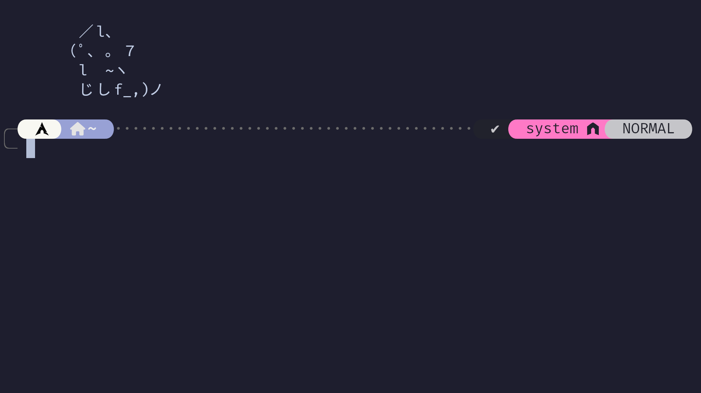

# zsh-maaru 🌟



## Advanced Zsh Configuration with Zinit

Welcome to `zsh-maaru`, my personal Zsh configuration powered by the versatile [Zinit plugin manager](https://github.com/zdharma-continuum/zinit). This setup includes curated plugins, a robust theme, and a streamlined installation process.

### Quick Links

- [Zinit Plugin Manager](https://github.com/zdharma-continuum/zinit) 🥳
- [Installation Script](./install.sh) 🥳🥳

---

## Zsh Plugins 🚀

The following plugins are installed via Zinit to enhance the Zsh experience:

```bash
# Zinit commands to install plugins
zinit light zsh-users/zsh-autosuggestions              # Suggest commands as you type
zinit light agkozak/zsh-z                              # Directory jumping
zinit light Aloxaf/fzf-tab                             # Enhanced tab completion
zinit light zsh-users/zsh-completions                  # Extra completions
zinit light djui/alias-tips                            # Suggests alias for commands
zinit light zdharma-continuum/fast-syntax-highlighting # Syntax highlighting
zinit light zsh-users/zsh-history-substring-search     # Search command history
zinit light seebi/dircolors-solarized                 # Better LS colors
zinit light paulirish/git-open                        # Open GitHub repositories
```

---

## Zsh Theme ✨

The configuration uses the highly customizable and visually stunning **Powerlevel10k** theme:

```bash
# Zinit command to install the theme
zinit light romkatv/powerlevel10k
```

> **Tip:** Run `p10k configure` after installation to set up your prompt.

---

## Directory Structure 🔂

- **`~/.zsh/`** - Contains all custom Zsh configuration files.
- **`~/.zshrc`** - Main configuration file loaded when Zsh starts.

---

## Installation Steps 🛠️

To get started, follow these steps:

## Clone the repository:

```bash
 git clone https://github.com/maarutan/zinit.zsh-maaru
 cd zinit.zsh-maaru

 # 2. Run the installation script:
 ./install.sh

 # 3. Restart your terminal or apply changes immediately:
 source ~/.zshrc
```

---

## Dependencies 🛠️

### Required Dependencies

The following tools are required for this configuration:

- `zsh`: The shell itself
- `curl`: For downloading Zinit
- `rsync`: For synchronizing configuration files
- `git`: For cloning repositories and installing plugins
- `fzf`: Command-line fuzzy finder
- `diffutils`: For comparing and updating files

### Automatic Installation on Arch Linux

If you are using Arch Linux, the installation script will automatically check for and install the above dependencies via `pacman`.

### Manual Installation for Non-Arch Systems

If you are not using Arch Linux, you will need to manually install these dependencies. For example:

#### On Ubuntu/Debian:

```bash
sudo apt update
sudo apt install zsh curl rsync git fzf diffutils -y
```

#### On macOS:

```bash
brew install zsh curl rsync git fzf diffutils
```

---

## Notes 📝

1. **Font Recommendation:** While this configuration does not require Nerd Fonts, using a Nerd Font like [Fira Code](https://www.nerdfonts.com/) can enhance the appearance of your terminal.
2. **Theme Setup:** After installation, run `p10k configure` to fully customize the Powerlevel10k theme.
3. **Restart Required:** Ensure you restart your terminal or source the configuration to apply the changes.

---

## Troubleshooting 🛠️

If you encounter any issues:

1. Check the script logs for error messages.
2. Verify that all dependencies are installed.
3. Open an issue in this repository for help!

---

With `zsh-maaru`, enjoy a fast, functional, and visually stunning Zsh experience! 😊
